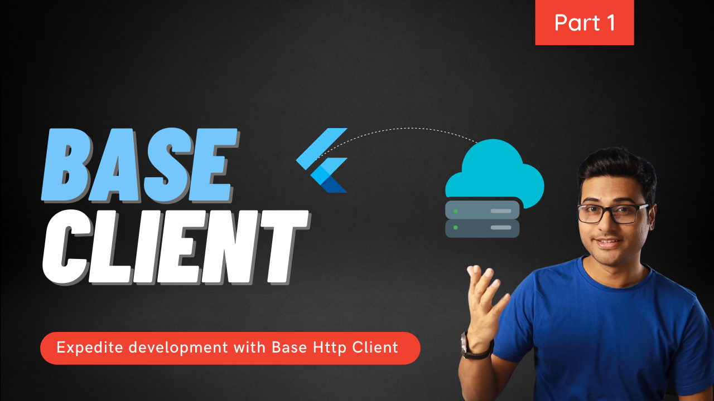

# Http Base Client | Flutter
Base Http Client to make all remote request

  

   
**Part 1** 
Base Client | Create apps faster with Flutter - Part 1 
https://youtu.be/9L0sbrzfPug

   
**Part 2** 
Base Client | Handle exceptions - Part 2 
https://youtu.be/k9k9ZGvurtQ

   
**Part 3** 
3️⃣ Common loader dialog | Flutter Base Client - Part 3 
https://youtu.be/7qx-XSqDuKE

If you like my work, support me to create more! 😎👍 

## Getting Started

This project is a starting point for a Flutter application.

A few resources to get you started if this is your first Flutter project:

- [Lab: Write your first Flutter app](https://flutter.dev/docs/get-started/codelab)
- [Cookbook: Useful Flutter samples](https://flutter.dev/docs/cookbook)

For help getting started with Flutter, view our
[online documentation](https://flutter.dev/docs), which offers tutorials,
samples, guidance on mobile development, and a full API reference.
